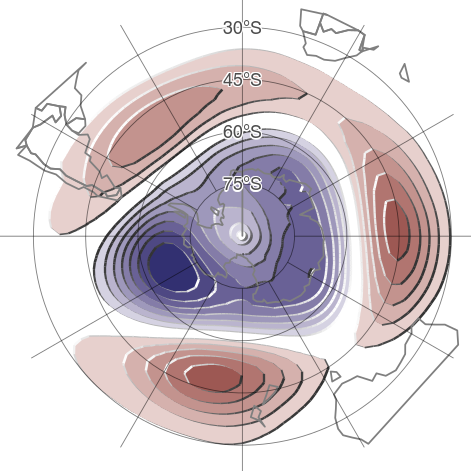
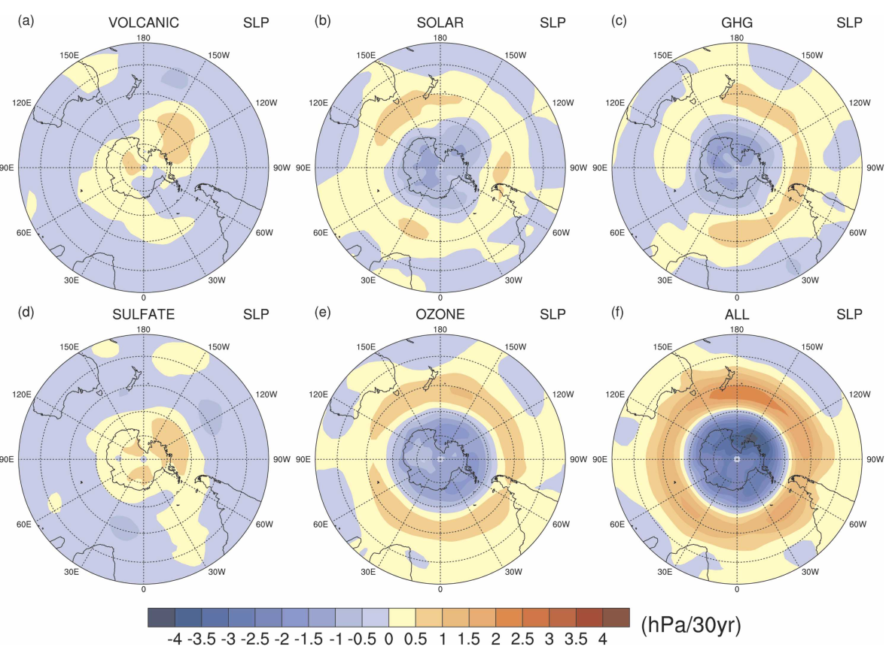
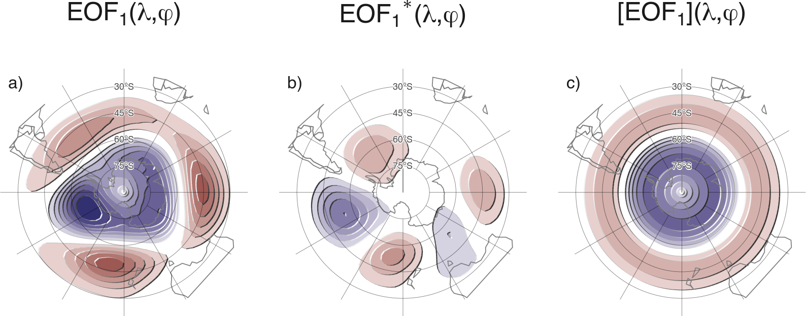
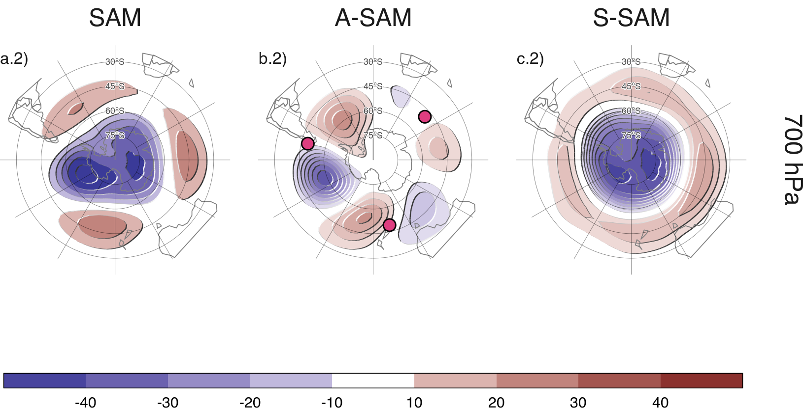
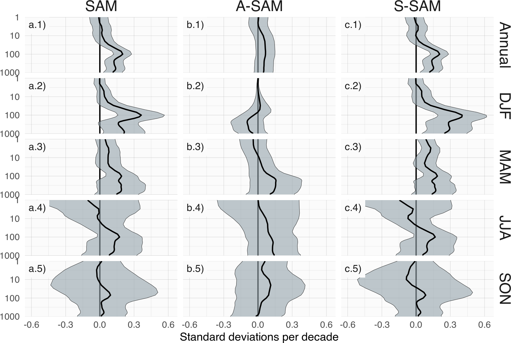
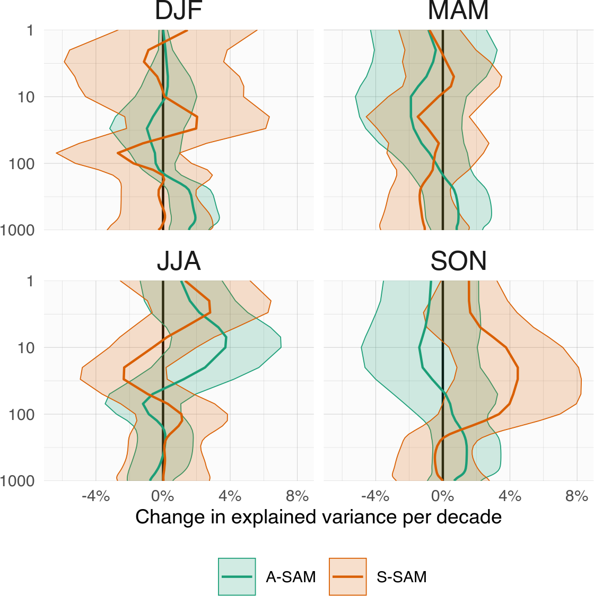
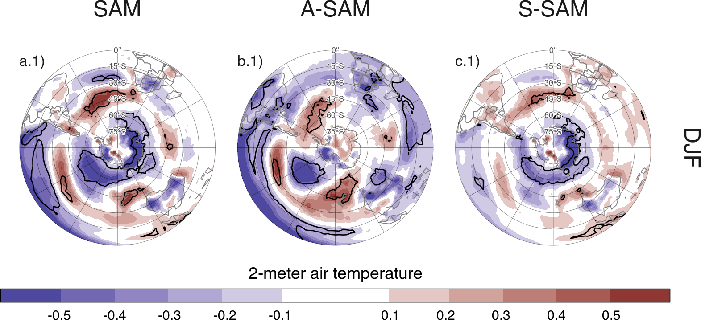

```{r setup, include=FALSE}
knitr::opts_chunk$set(code_folding = FALSE, echo = FALSE)
knitr::knit_hooks$set(crop = knitr::hook_pdfcrop)
```

Today I got my first paper published!
🎉

Along with my PhD advisors, [Leandro Díaz](https://www.researchgate.net/profile/Leandro-Diaz-4) and [Carolina Vera](https://twitter.com/carovera_ar), we wrote "[Assessment of zonally symmetric and asymmetric components of the Southern Annular Mode using a novel approach](https://doi.org/10.1007/s00382-021-05896-5)" (because it wouldn't be an academic publication if the title was shorter), and this post is a general explanation of the main methods and takeaways of the paper.

## What's the deal with the SAM

Climatologists love to think of the climate as a series of different modes.
That is, take all the incomprehensible complexity of the evolving climate and distil it to a handful of phenomena that we can understand.
For example, instead of having to think about all the variability of the Equatorial Pacific Ocean, which is a 3D field with multiple variables, you can think about the [El Niño--Southern Oscillation](https://www.climate.gov/news-features/blogs/enso/what-el-ni%C3%B1o%E2%80%93southern-oscillation-enso-nutshell) (ENSO) phenomenon, which can be characterised by a single time series.
Other members of the "Climate Oscillations Hall of Fame", and their respective acronyms, are the Indian Ocean Dipole (IOD), the Northern Annular Mode (NAM), the North Atlantic Oscillation (NAO) and, important for this paper, the **Southern Annular Mode (SAM)**.

The SAM describes an oscillating pattern of alternating low and high pressure anomalies over Antarctica and in the middle latitudes.
To have a clear picture, the typical field of pressure anomalies when the SAM is on it's positive phase looks like Figure \@ref(fig:sam).

(ref:sam-cap) Typical pressure anomalies of the positive phase of the SAM. Lower pressure than usual over the Antarctic and higher pressure than usual in the mid-latitudes.

```{r sam, echo=FALSE, fig.cap="(ref:sam-cap)", fig.align='center'}

```

As you can see, this pattern lives up to its name in that the positive pressure anomalies form a ring (or, for the hoity-toity scientists, an annulus) around the negative pressure anomalies.
In fact, almost every paper on the topic starts the introduction with a sentence along the lines of "The SAM is approximately zonally symmetric..." [@fogt2020] --where "zonally symmetric" means that it doesn't depend on longitude.
The word "approximately" is doing a lot of heavy lifting: the zonally symmetric ring is clearly deformed by zonally *asymmetric* anomalies.

Most papers basically ignore these deviations from zonal symmetry and think of the SAM as zonally symmetric.
This is fine as a first order approximation, but many aspects of the SAM are actually tied to its asymmetric nature.
For example, the SAM is associated with anomalies in meridional (north--south) wind, which is not possible for a zonally symmetric pattern.
And these meridional wind anomalies clearly are related to impacts in precipitation in over South America [@silvestri2009] and temperature over the Antarctic Peninsula [@fogt2012]. These anomalies are also conspicuously similar to the effect of ENSO on these higher latitudes [e.g. @clem2013].

The understanding of the SAM as zonally symmetric also influences the theories behind the positive trend of the SAM index seen during the austral summer.
Simulations show that increased concentrations of greenhouse gases and changes in stratospheric ozone combine to produce a zonally symmetric change of lower pressures over the poles and higher pressures at lower latitudes (Figure \@ref(fig:trend-forcings) from @arblaster2006).
Since these changes are similar to the positive phase of the SAM, then it's only logical to identify this simulated changes with the observed SAM trend.
But, of course, this only works for a zonally symmetric SAM.

(ref:trend-forcings-cap) Trends in sea level pressure for the 1958--1999 period simulated with climate models that include various forcings. From @arblaster2006.

```{r trend-forcings, echo=FALSE, fig.cap="(ref:trend-forcings-cap)",  out.extra="class=external"}

```

In essence, all evidence point to the fact that the asymmetric part of the SAM can have different sources of variability, different impacts, and different trends.
So what we wanted to do is to try to separate the SAM into two indices, and index for the symmetric part of the SAM, and another for the asymmetric part of the SAM.
The hope being that by studying these indices we could understand better the relationships between other parts of the climate to each part of the SAM.

## How to divide the SAM

What we did was, for each vertical level, to take the classical SAM pattern that we all know and love (Fig. \@ref(fig:method)a) and create two derived fields.
The zonal mean field, which represents the zonally symmetric SAM (Fig. \@ref(fig:method)c) and then the difference between the full SAM field and the zonal mean, which represents the zonally asymmetric SAM (Fig. \@ref(fig:method)b).
This figure really shows that the magnitude of the zonal anomalies is on par with the magnitude of the zonal mean!

(ref:method-cap) Spatial patterns of the first EOF of 700\\ hPa geopotential height for 1979 -- 2018 period. (a) Full field, (b) zonally asymmetric component and (c) zonally symmetric component. Arbitrary units; positive values in blue and negative values in red.

```{r method, echo=FALSE, fig.cap="(ref:method-cap)"}

```

We then projected monthly field into these three fields (again, for each vertical level) to obtain three time series, one for the classic "full" SAM, one for the asymmetric SAM (A-SAM) and one for the symmetric SAM (S-SAM).

As a sanity check, Figure \@ref(fig:2dregr) shows the regression of 700 hPa geopotential height and the three indices (the ones between A-SAM and S-SAM are actually the coefficients of multiple regression, check the paper for the details).
And it works!
The regression pattern of the full SAM index is the now-familiar SAM pattern.
The pattern associated with the S-SAM is much more zonally symmetric and the one associated with the A-SAM is zonally asymmetric.

(ref:2dregr-cap) Regression of 700 hPa geopotential height (meters) with (column a) SAM, (column b) A-SAM, and (column c) S-SAM for the 1979 -- 2018 period.

```{r 2dregr, echo=FALSE, fig.cap="(ref:2dregr-cap)"}

```

## The two faces of the SAM

With these indices at hand, we can now study the behaviours that are unique of the asymmetric or the symmetric SAM.
For example, before I talked about the positive trend in the SAM index.
Figure \@ref(fig:trends) show linear trends (in standard deviations per decade) for each index at each vertical level of the atmosphere.

(ref:trends-cap) Linear trends (in standard deviations per decade) at each level for annual (row 1) and seasonal values (rows 2 to 5) for the period 1979 -- 2018 and for the (column a) SAM index, (column b) A-SAM index, and (column c) S-SAM index. Shading indicates the 95% confidence interval from a t-distribution.

```{r trends, echo=FALSE, fig.cap="(ref:trends-cap)"}

```

Not surprisingly we detect the already-known positive trend of the SAM index, which is only present in the summer (and a but in autumn) and only in the troposphere (Fig. \@ref(fig:trends) column a).
But what we also show is that only the symmetric part of the SAM has experienced a increase towards positive values (Fig. \@ref(fig:trends) column c), while the asymmetric part of the SAM appears to have suffered no long term (linear) trends ((Fig. \@ref(fig:trends) column b).
Another added value of our paper is the computation of trends along many vertical levels.
Most studies look at trends for a single SAM index defined using either 700 hPa geopotential height or sea level pressure.
Here we show that the positive trend actually reaches its maximum near 100 hPa, which is much higher in the atmosphere.

(ref:trends-r2-cap) Linear trends (in percent per decade) of the variance explained by A-SAM and S-SAM at each level and for each trimester for the period 1979 -- 2018.

```{r trends-r2, echo=FALSE, fig.cap="(ref:trends-r2-cap)"}

```

Another interesting question is whether the SAM has become more or less asymmetric.
@fogt2012 suggested that the SAM is becoming more symmetric in summer and autumn between 1960 and 2000.
In our study we use data between 1979 and 2018 (data before 1979 is highly suspect due to the lack of satellite observations) so it's not terribly comparable, but we reach the opposite conclusion.
Figure \@ref(fig:trends-r2) shows linear trends of the explained variance of each index at each vertical level.
In summer, the variance explained by the A-SAM in lower levels has increased by about 2% per decade.
Honestly, this is not strong evidence by itself, so more research is needed™.

All that (and more!) indicates that the asymmetric part of the SAM behaves differently from the symmetric part.
But we also show that they have different surface impacts.

(ref:air-cap) Regression of summer mean 2-metre temperature anomalies (Kelvin) from ERA5 with SAM, A-SAM and S-SAM for the 1979 -- 2018 period. Black contours indicate areas with p-value smaller than 0.05 controlling for False Detection Rate. Note that the colour scale cuts-off at $\pm0.6 \mathrm{K}$ to highlight mid-latitudes and tropics features at the expense of the higher values in polar regions.

```{r air, echo=FALSE, fig.cap="(ref:air-cap)"}

```

Panel a.1 in Figure \@ref(fig:air) shows the regression between summer mean temperature and the classic SAM index.
Compare it with panels b.1 and c.1, which show the same but for the A-SAM and S-SAM index.
In most areas, you can see a relatively clean separation of the SAM relation ship into the asymmetric and symmetric component.
For instance, in the Antarctic region positive values of the SAM are associated with negative temperature anomalies in an incomplete ring surrounding the continent.
This ring is mostly explained by the S-SAM, while the A-SAM relationship with temperature is not so strong in these high latitudes.

You can look at the maps and find other differences (maps for other seasons are available on [the paper](https://rdcu.be/ctKWP)), but I here I want to highlight what happens in the tropical oceans.
Both in the Pacific and Indian ocean, there is no significant relationship between the SAM and air temperature, but there *is* a relationship between the A-SAM and temperatures there.
That's interesting to me, because it suggests that in some regions, there is an effect of the A-SAM that is *masked* by the S-SAM and thus is not detectable by using the full SAM index, which mixes the two.

If "temperature of the tropical Pacific" made you think of ENSO, you are not alone.
It is known that ENSO is somewhat correlated with the SAM, but did you know know that there is no correlation between the zonally symmetric part of the SAM and ENSO in any season?
If you look at Table \@ref(tab:enso-cor), now you know!
In fact, Table \@ref(tab:enso-cor) also shows that the correlation with ENSO is higher for the A-SAM index than for the SAM index in all seasons except DJF.

```{r enso-cor}
library(kableExtra)
data.frame(
  stringsAsFactors = FALSE,
            index = c("SAM","A-SAM","S-SAM"),
            Year = c("-0.17\n(0.001)","-0.26\n(<0.001)","0.02\n(0.775)"),
            DJF = c("-0.31\n(0.002)","-0.30\n(0.003)","-0.17\n(0.115)"), 
            MAM = c("-0.07\n(0.530)","-0.26\n(0.011)","0.14\n(0.192)"), 
            JJA = c("0.01\n(0.900)","-0.14\n(0.192)","0.11\n(0.300)"), 
            SON = c("-0.25\n(0.014)","-0.42\n(<0.001)","0.05\n(0.686)")
) |> 
  data.table::transpose(keep.names = "season", make.names = "index") |> 
    kbl(align = "c", 
      caption = "Correlation between SAM indices and the Oceanic Niño Index. p-values corrected for False Detection Rate in parenthesis. In bold, correlations with p-value smaller than 0.05.",
      booktabs = TRUE, 
       col.names = c("", "SAM", "A-SAM", "S-SAM")) |> 
  kable_classic_2(full_width = TRUE) |>
  column_spec(2, bold = c(TRUE, TRUE, FALSE, FALSE, TRUE)) %>%
  column_spec(3, bold = c(TRUE, TRUE, TRUE, FALSE, TRUE)) %>%
  # column_spec(4, bold = ) %>%
  collapse_rows(columns = 1:2, valign = "top") |> 
  add_header_above(c(" " = 1, "Correlation" = 1,
                     "Partial correlation" = 2))
```

This is exciting because it says that if you want to study the relationship between the SAM and ENSO, you should probably look only at the S-SAM.

## More SAM

If this piqued your interest, go read [the rest of the paper](https://doi.org/10.1007/s00382-021-05896-5) (click [here](https://rdcu.be/ctKWP) for a free, but DRMd copy).
It covers other issues, such as the cross-correlation among levels, vertical regressions, and the relationship with precipitation.
But overall, the point is that not only it's possible to split the Southern Annular Mode into a zonally symmetric and a zonally asymmetric part, but it seems to be both physically meaningful and statistically useful.

If you want to use this on your research, you can get all the code that produced the paper on [this repository](https://github.com/eliocamp/asymsam) and get the data for the three SAM indices [here](http://www.cima.fcen.uba.ar/~elio.campitelli/asymsam/#get-the-data).
