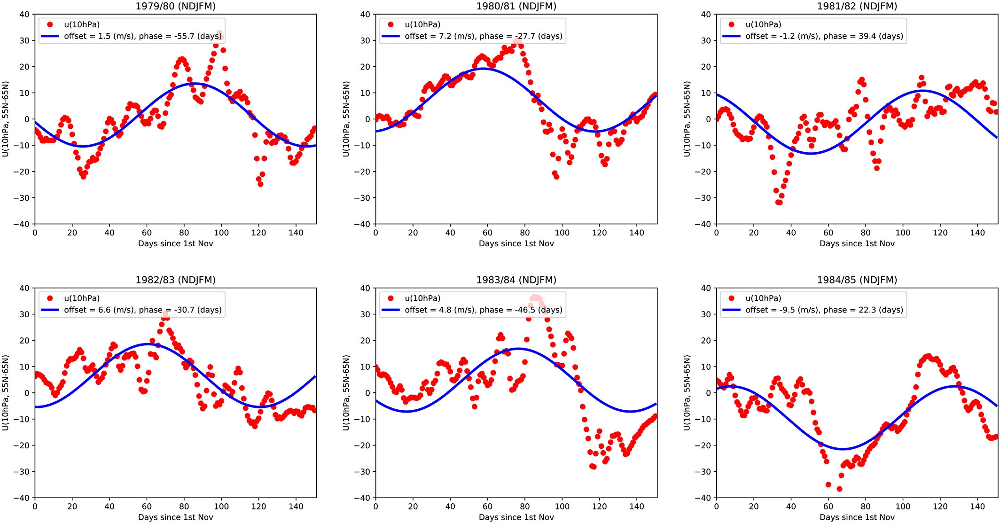
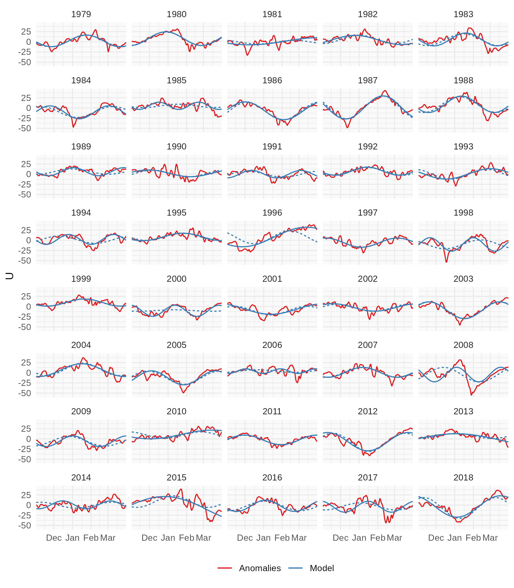

```{r setup, include=FALSE}
knitr::opts_chunk$set(code_folding = FALSE, echo = FALSE, cache = TRUE, cache.extra = 1)
knitr::knit_hooks$set(crop = knitr::hook_pdfcrop)

knitr::opts_hooks$set(label = function(options) {
  if (is.null(options$fig.cap)) {
    options$fig.cap <- paste0("(ref:", options$label, "-cap)")
  }
  options
})

library(metR)
library(data.table)
library(ggplot2)
library(magrittr)
library(patchwork)

theme_set(theme_minimal() +
            theme(panel.background = element_rect(fill = "#fafafa", color = NA),
                  legend.position = "bottom"))

DT <- `[`

strip_year <- function(time) {
  lubridate::year(time) <- 2000
  time
}

strip_climyear <- function(x) {
  lubridate::year(x) <- ifelse(data.table::month(x) %in% c(1:3), 2001, 2000)
  x
}

climyear <- function(x) {
  year <- year(x)
  ifelse(month(x) %in% c(1:3), year-1, year)
}
```

Last week on [the Journal Club](https://thestratosphere.co.uk/journalclub/) I participate in we read [Subseasonal Vacillations in the [boreal] Winter Stratosphere](https://agupubs.onlinelibrary.wiley.com/doi/full/10.1029/2020GL087766) (@Hardiman).
The data and methods were not too complicated and I had some small issues with some of the decisions so I was delighted to once again delve into a paper and try to reproduce it. 

The underlining theory is that, due to the interaction between the zonal mean flow and the zonal waves, the stratospheric jet "vacillates" (d.h. oscillates) in a relatively regular way. 
From that, the authors posit that a simple sine wave model could predict the jet strength. 
The conclusions are not very strong in that while the sine wave model is a relatively better fit than a linear model, it doesn't have increased predictive power. 

Here I'll replicate these methods with some minor changes and explore the results.


```{r read-data}
u <- fread(here::here("_data/uwind-sinewave/uwind.csv")) 

complete <- u[, .N, by = climyear(time)] %>% 
  .[N > 360]

u <- u[climyear(time) %in% complete$climyear]
u[, time2 := strip_year(time[1]), by = time]
```

First, I downloaded 00:00 UTC zonal wind hourly data from ERA5 at 10 hPa between between 55ºN and 65ºN. 
Figure \@ref(fig:timeseries) shows the timeseries, which has a very strong seasonal cycle. 

(ref:timeseries-cap) Daily zonal mean zonal wind at 10 hPa, averaged between 55ºN and 65ºN.

```{r timeseries}
u %>% 
  ggplot(aes(time, u)) +
  geom_line() +
  scale_x_datetime(NULL) +
  scale_y_continuous("U")
```

To remove the seasonal cycle, @Hardiman removed the climatological mean following @MacLachlan: 

> Using the climatological (i.e., average across all years) daily U data, a rolling 61 day mean is formed (i.e., ±30 days), weighted with the function
> 
> $$w=\mathrm e^{\frac{-d^2}{100}}$$
>
> where d is the lag/lead in days from the central day (i.e., an exponential decay on a time scale of 10 days). This climatological daily rolling mean is then removed from the daily winds for each year, producing the anomalous daily wind field.

The idea here is that the seasonal cycle computed by just the daily averages can be noisy due to sampling variability.
So they smooth it out with a weighted rolling mean function. 

This might be fine, but I'm usually not a fan of rolling mean for this because it can have issues at the boundaries.
Not only the mean is computed from fewer datapoints, but there is no assurance that the annual cycle to be periodic (the 31st of December needs to be almost equal to the 1st of January). 

My preferred solution is to use Fourier (I dare you to find a problem that's not solved with Fourier). 
Just filter out the higher wavenumbers to get a smooth and periodic seasonal cycle.
In this case, I filtered out wavenumbers greater than 3. 

```{r mean_u}
mean_u <- u %>%
  # .[time %between% gl$climatology] %>%
  .[, .(mean = mean(u)), by = .(time2) ] %>%
  .[order(time2)] %>%
  .[, mean2 := FilterWave(mean, seq(0, 3))] 
```


(ref:climatology-cap) Seasonal cycle of zonal mean zonal wind at 10 hPa, averaged between 55ºN and 65ºN. Raw cycle in read and a smoothed version in blue. 

```{r climatology, fig.height=3, fig.width=5}
ggplot(mean_u, aes(time2)) +
  geom_line(aes(y = mean, color = "Raw climatology")) +
  geom_line(aes(y = mean2, color = "Smoothed climatology")) +
  scale_x_datetime(NULL, date_labels = "%b", date_breaks = "1 month", expand = c(0, 0)) +
  scale_color_brewer(palette = "Set1") +
  labs(y = "U",
       color = NULL)
```

As you can see in Figure \@ref(fig:climatology), the raw climatology is not super noisy (I've seen noisier) but the smoothed-out version is much better. 
The difference is specially important in the boreal Winter months, which is the ones we are interested in!
The choice of maximum wavenumber does change the smooth slightly (of course).
I chose 3 just by eye, but I suspect one could get to a more objective and automatic number using cross-validation (I dare you to find a problem that's not solved with cross-validation).

```{r remove-mean}
u <- u %>%
  mean_u[., on = "time2"] %>% 
  .[, anom := u - mean2]
```

Next, after removing this smooth climatology, @Hardiman fits a sine wave model to each year's November-March period. 
Initially they fit the model

$$
U = \bar{U} + A\sin(\mathit{freq}(\mathit{time} + \mathit{phase}))
$$

in which $\bar{U}$ is the mean zonal wind anomaly of that winter (what they call "offset"), $A$ is the amplitude of the vacillation, $\mathit{freq}$, its frequency and $\mathir{phase}$, its phase. 
After fitting this model, they then decide to opt for a simpler model with only $\bar{U}$ and $\mathit{phase}$ as free parameters and $A$ and $\mathit{freq}$ fixed as $12\ ms^{−1}$ and 120 days respectively, which are approximatedly the mean values from the 4-parameter fit.

I honestly don't really get why they do this. 
While it's important to be mindful of the fact that the goodness of fit improves monotonically with the number of parameters, I don't see why 4 parameters is too much and 2 is fine. 
Considering that each winter has between 151 and 152 observations (depending on the leap-ness of the year), 4 parameters doesn't seem to be anywhere near the overfitting danger-zone. 
Besides, since they fix the two other parameters based on the same data, it's not even technically true that they are only fitting 2 parameters! 

From a physical argument I would believe that fixing the frequency is desirable if one knows the approximate timescale of the phenomenon. 
But the change amplitude is a fundamental aspect of the vacillations; the main idea of this process is that a weaker jet will have stronger oscillations. 
They even test this with their 4-parameter fit. 
So I don't really understand why they decided to keep it fixed. 

I will ignore this parameter restriction and instead fit the full 4-parameter model. 
The only restriction is that the maximum period I'm allowing is 300 days. 

Getting the sine wave fit was a bit of a challenge. 
At first I was trying to use the `nls()` function, which performs Nonlinear Least Squares, but it not only errored out plenty of times due to numerical issues, but even when it ran without errors it would return nonsensical fits. 

In the end, I decided to linearise the sine wave model for a fixed frequency, fit this linear model for a relatively large set of frequencies, and keep the model with the lowest Residual Sums of Squares. 

Below is the R code I came up with, for which I'm not entirely proud, but also not completely ashamed.

```{r fit_sin, echo=TRUE}
fit_sin <- function(x, time) {
  t <- seq_along(x)
  
  # Try a bunch of periods and 120 (from the authors)
  # (linear grid probably not the best)
  periods <- 150*seq(1/10, 2, length.out = 200)
  periods <- c(periods, 120)
  frequencies <- 2*pi/periods
  
  models <- list()
  for (k in seq_along(frequencies)) {
    models[[k]] <- .lm.fit(cbind(1, cos(frequencies[k]*t), sin(frequencies[k]*t)), x)
  }
  
  # Chose the one with lower RMSE
  rmse <- vapply(models, function(model) sd(resid(model)), numeric(1))
  model <- models[[which.min(rmse)]]
  model120 <- models[[length(periods)]]
  
  # Return for the best and the 120-day model:
  #   a model element with the fitted parameters
  #   a fit element with fitted values, residuals and stuff. 
  resid <- resid(model)
  resid120 <- resid(model120)
  list(model = data.table::data.table(mean = coef(model)[1], 
                                      amplitude = sqrt(coef(model)[2]^2 + coef(model)[3]^2),
                                      frequency = frequencies[which.min(rmse)],
                                      period = periods[which.min(rmse)],
                                      phase =  atan(coef(model)[3]/coef(model)[2])),
       fit = data.table::data.table(
         pred = x - resid,
         resi = resid,
         x = x,
         t = seq_along(x),
         time = time
       ),
       model120 = data.table::data.table(mean = coef(model120)[1], 
                                         amplitude = sqrt(coef(model120)[2]^2 + coef(model120)[3]^2),
                                         frequency = frequencies[length(periods)],
                                         period = periods[length(periods)],
                                         phase =  atan(coef(model120)[3]/coef(model120)[2])),
       fit120 = data.table::data.table(
         pred = x - resid120,
         resi = resid120,
         x = x,
         t = seq_along(x),
         time = time
       )
       
  )
}
```

```{r models}
models <- u %>% 
  .[month(time) %in% c(1:3, 11, 12)] %>% 
  .[order(time)] %>% 
  .[, .(model = list(fit_sin(anom, time))), by = .(year = climyear(time))] 
```

Figure \@ref(fig:examples) shows the first nine years with their fit in blue. 
In some years, such as 1979and 1981 the jet does show oscillations consistent with the sine wave fit. 
In other years, like 1981 of 1985, the amplitude of the oscillation is minimal and not a very good fit. 


```{r examples, fig.width=7, fig.height=5}
models %>% 
  copy() %>% 
  .[, rbind(best = model[[1]]$fit, 
            fixed = model[[1]]$fit120, idcol = "method"), by = year] %>% 
  .[year %in% c(1979:1987)] %>% 
  .[, time := strip_climyear(time)] %>% 
  ggplot(aes(time, x)) +
  geom_line(aes(color = "Anomalies")) +
  geom_line(aes(y = pred, color = "Model", linetype = method)) +
  scale_x_datetime(NULL, expand = c(0, 0)) + 
  scale_y_continuous("U") +
  scale_color_brewer(NULL, palette = "Set1", direction = 1) +
  scale_linetype(guide = "none") +
  facet_wrap(year~.) 
```


The dotted line show the fit if the frequency is kept fixed at 120 days but the amplitude is allows to vary (so a 3-parameter fit). 
Both lines feature a similar fit to the data since they only diverge when the amplitude of the wave is low.
In those year, the sinusoidal is more or less a straight line and thus the period makes little difference to the fit. 

Compared with @Hardiman's Figure 2 reproduced below, their 2-parameter fit is not super bad for the years with reasonable oscillations, but it overfits strong vacillations in the "flat" years.
This is mainly due to the fixed amplitude, as discussed before.

(ref:fig1-cap) Same as Figure \@ref(fig:examples) but from @Hardiman. 

```{r fig1, echo=FALSE, fig.cap="(ref:fig1-cap)",  out.extra="class=external"}

```

```{r save-allfits}
bydate <- models %>% 
  copy() %>% 
  .[, rbind(best = model[[1]]$fit, 
            fixed = model[[1]]$fit120, idcol = "method"), by = year] %>% 
  .[, time := strip_climyear(time)] %>% 
  ggplot(aes(time, x)) +
  geom_line(aes(color = "Anomalies")) +
  geom_line(aes(y = pred, color = "Model", linetype = method)) +
  scale_x_datetime(NULL, expand = c(0, 0)) +
  scale_y_continuous("U") +
  scale_color_brewer(NULL, palette = "Set1", direction = 1) +
  scale_linetype(guide = "none") +
  facet_wrap(year~., ncol = 5) 

ggsave("figs/bydate.png", width = 7, height = 8, bg = "white")

by_rmse <- models %>% 
  copy() %>% 
  .[, rbind(best = model[[1]]$fit, 
            fixed = model[[1]]$fit120, idcol = "method"), by = year] %>% 
  .[, time := strip_climyear(time)] %>% 
  .[, rmse := sd(pred[method == "best"] - pred[method == "fixed"]), by = .(year)] %>% 
  .[, year := reorder(year, -rmse)] %>% 
  ggplot(aes(time, x)) +
  geom_line(aes(color = "Anomalies")) +
  geom_line(aes(y = pred, color = "Model", linetype = method)) +
  scale_x_datetime(NULL, expand = c(0, 0)) +
  scale_y_continuous("U") +
  scale_color_brewer(NULL, palette = "Set1", direction = 1) +
  scale_linetype(guide = "none") +
  facet_wrap(year~., ncol = 5) 

ggsave("figs/byrmse.png", width = 7, height = 8, bg = "white")
```


```{js}
function change_allfits(newVal){
  document.getElementById("allfits").src = "figs/" + newVal + ".png";
}
```

For completeness, Figure \@ref(fig:allfits) shows all fits for all years. 
You can sort the years <a href="javascript:change_allfits('bydate')">chronologically</a> or <a href="javascript:change_allfits('byrmse')">by the difference between the two fits</a>. 
Honestly, the fixed-frequency model is not super bad except for a few cases. 
But that's not mind-blowing, since the fixed number was actually based on the full 4-parameter model. 

(ref:allfits-cap) Same as Figure \@ref(fig:examples) but for all years. Ordered <a href="javascript:change_allfits('bydate')">chronologically</a> or <a href="javascript:change_allfits('byrmse')">by the difference between the two fits</a>. 

```{r allfits, fig.height=8, fig.width=7, out.extra="id='allfits'"}

```

Weave-mean flow interaction theory predicts that a weaker jet should be more wavy than a stronger jet. 
Therefore, there should be a negative correlation between the mean zonal wind zonal mean and the amplitude of the vacillations. 
@Hardiman claim to have found this negative correlation:

> (...) across all years, the offset of these sine waves is negatively correlated to their amplitude (correlation coefficient =−0.36 [...]).

Figure \@ref(fig:u-amplitude) shows the relationship between the mean zonal wind and the amplitude in the 4-parameter model. 
There seems to be a relationship, but is not as simple as the model predicts. 
Is not just a monotonic decrease in amplitude with increase in jet strength, but for some critical value of jet stength, the amplitude is relatively constant or even increasing; although there are not a lot of datapoints to make the relationship very clear. 

```{r u-amplitude, fig.width=5, fig.height=3}
models %>% 
  .[, model[[1]]$model, by = year] %>% 
  ggplot(aes(mean, amplitude)) +
  geom_point() +
  geom_smooth(color = "#0d52bf") +
  scale_x_continuous("Mean U") +
  scale_y_continuous("Sine Amplitude") 
```

```{r cors}
cors <- models %>% 
  .[, model[[1]]$model, by = year] %>% 
  .[, cor.test(mean, amplitude)]

cor_text <- paste0(scales::number(cors$estimate, accuracy = 0.01), " (CI: ", paste0(scales::number(cors$conf.int,, accuracy = 0.01), collapse = " -- "), ")")
```

As far as the correlation goes, the correlation between the mean zonal wind and the sine amplitude is `r cor_text`, which is consistent with @Hardiman. 


<!-- ```{r histograms, fig.width=6, fig.height=3} -->
<!-- models %>%  -->
<!--   .[, model[[1]]$model, by = year] %>%  -->
<!--   ggplot(aes(amplitude)) + -->
<!--   geom_histogram(binwidth = 2.5, boundary = 9.5, fill = "#7e8087") + -->
<!--   scale_x_continuous(breaks = pretty) + -->


<!--   models %>%  -->
<!--   .[, model[[1]]$model, by = year] %>%  -->
<!--   ggplot(aes(period)) + -->
<!--   geom_histogram(binwidth = 10, boundary = 80,  fill = "#7e8087") + -->
<!--   scale_x_continuous(breaks = pretty) + -->
<!--   scale_y_continuous(NULL) + -->

<!--   plot_layout(guides = "collect") -->
<!-- ``` -->
