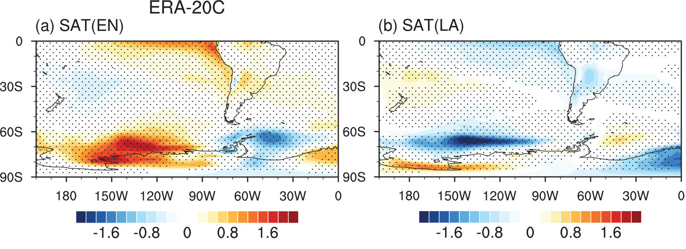

```{r setup, include=FALSE}
knitr::opts_chunk$set(code_folding = FALSE, 
                      echo = FALSE, 
                      cache = TRUE, 
                      cache.extra = 3, 
                      fig.width = 8,
                      fig.align = "center")
knitr::knit_hooks$set(crop = knitr::hook_pdfcrop)

knitr::opts_hooks$set(label = function(options) {
  if (is.null(options$fig.cap)) {
    options$fig.cap <- paste0("(ref:", options$label, "-cap)")
  }
  
  if (is.null(options$fig.alt)) {
    options$fig.alt <- paste0("(ref:", options$label, "-alt)")
  }
  options
})

library(metR)
library(data.table)
library(ggplot2)
library(gggrid)

theme_set(theme_minimal() +
            theme(panel.background = element_rect(fill = "#fafafa", color = NA),
                  legend.position = "bottom",
                  legend.title.position = "top", 
                  legend.title = element_text(hjust = 0.5),
                  legend.frame = element_rect(color = "black", linewidth = 0.4),
                  legend.key.height = unit(0.75, "lines")
            ))
wide_legend <- theme(legend.key.width = unit(1, 'null'))

old <- suppressMessages(sf::sf_use_s2(FALSE))
qmap <- function(xlim = NULL, ylim = NULL) {
  list(
    scale_x_continuous(name = NULL, expand = c(0, 0)),
    scale_y_continuous(name = NULL, expand = c(0, 0)),
    eliotesis::geom_qmap(),
    coord_sf(xlim = xlim, ylim = ylim)
  )
}

map <- qmap(ylim = c(-89, 0), xlim = c(160, 360))

plimit <- 0.05
geom_contour_pval <- function(mapping, p.value = plimit, linewidth = 0.1, hatch = 0,
                              pattern_density = 0.1, pattern_spacing = 0.05, ...) {
  mapping2 <- mapping
  mapping2$fill <- aes(fill = NA)$fill
  
  
  pattern_dots <- ggplot2::ggproto("GeomDots", ggpattern::GeomPolygonPattern)
  ggplot2::update_geom_defaults(pattern_dots,
                                list(pattern = "circle",
                                     colour = NA,
                                     pattern_colour = "black",
                                     pattern_fill = "black",
                                     pattern_density = pattern_density,
                                     pattern_alpha = 0.8,
                                     pattern_spacing = pattern_spacing,
                                     fill = NA
                                ))
  
  
  
  list(
    stat_contour_filled(mapping2, breaks = c(hatch, p.value), fill = NA,
                        geom = pattern_dots, ...),
    geom_contour2(mapping, breaks = p.value, linewidth = linewidth, ...)
  )
}


```

I was reading a paper about the influence of ENSO on Antarctic Sea Ice and in the introduction they mentioned that the effects of El Niño and La Niña are not linear, along with a few citations.  

> In addition, there are asymmetric impacts between warm (El Niño) and cold (La Niña) ENSO events, stressing the importance of considering the nonlinearity of the sea ice responses (Yuan 2004; Simpkins et al. 2012; Y. Wang et al. 2022).

The most recent of those citations was Wang 2022 so I decided to check it out and I got immediately sidetracked because it felt like a good case study for my campaign against composites. 
So I downloaded the data and started doing plots, and then got immediately sidetracked from *that* because I couldn't even reproduce their results in the first place!

I'm going to focus on their Figure 2, in which they show composites of Surface Air Temperature for El Niño and La Niña events and which I show here with just a slight format modification. 

```{r fig.cap="Figure from https://example.com", out.extra="class=external"}

```

They say that this figure shows the asymmetry between the effects of El Niño and La Niña:

> During El Niño years, a dipole in SAT anomalies exists between West Antarctica and the Antarctic Peninsula. Anomalous southerly winds advect cold air that cools the peninsula, and anomalous northerly winds advect warm air that warms West Antarctica. In contrast, during La Niña, the Antarctic Peninsula experiences only a minor temperature change. 

They mean here that the blue patch east of the Antarctic Peninsula in the left panel is much more intense than the corresponding orange patch in the right panel. 
In my eyes, another important difference are the anomalies over the coast of the Amundsen Sea (between 150°W and 120°W) which is absent in the La Niña composite, and the positive anomalies in over the Ross Sea in the La Niña composite that has no corresponding anomalies in the El Niño composite. 

```{r download_data}
sat_file <- "~/Downloads/sat.nc"

if (!file.exists(sat_file)) {
  request <- list(
    format = "netcdf",
    product_type = "monthly_averaged_reanalysis",
    variable = "2m_temperature",
    year = c("1979", "1980", "1981", "1982", "1983", "1984", "1985", "1986", "1987", "1988", "1989", "1990", "1991", "1992", "1993", "1994", "1995", "1996", "1997", "1998", "1999", "2000", "2001", "2002",
             "2003", "2004", "2005", "2006", "2007", "2008", "2009", "2010", "2011", "2012", "2013", "2014", "2015", "2016", "2017", "2018", "2019", "2020", "2021", "2022", "2023"),
    time = "00:00",
    month = c("06", "07", "08"),
    grid = c(1, 1),
    area = c(0, 160, -90, 360),
    dataset_short_name = "reanalysis-era5-single-levels-monthly-means",
    target = basename(sat_file)
  )

  ecmwfr::wf_request(request, path = dirname(sat_file), user = "11343")
}
```


```{r}
sat_file_ncep <- "~/Downloads/sat_ncep.nc"

if (!file.exists(sat_file_ncep)) {
  download.file("https://downloads.psl.noaa.gov/Datasets/ncep.reanalysis2/Monthlies/gaussian_grid/air.2m.mon.mean.nc", 
                sat_file_ncep)  
}

```

```{r}
hgt_file_ncep <- "~/Downloads/hgt_ncep.nc"

if (!file.exists(hgt_file_ncep)) {
  download.file("https://downloads.psl.noaa.gov/Datasets/ncep.reanalysis2/Monthlies/pressure/hgt.mon.mean.nc", 
                hgt_file_ncep)  
}

```


```{r read_data}

atmosphere <- ReadNetCDF(sat_file_ncep, vars = c(value = "air"), 
                         subset = list(lat = c(-90, 0),
                                       lon = c(160, 360))) |> 
  _[year(time) >= 1979] |> 
  _[year(time) <= 2015] |> 
  _[season(time) == "JJA"] |> 
  _[, time := as.Date(time)] |> 
  _[, .(value = mean(value)), by = .(lon, lat, time = seasonally(time))] |> 
  _[, value := value - mean(value), by = .(lon, lat, season(time))] 

years_en <- c(1982, 1987, 1991, 1997, 2002, 2004, 2009, 2015)
years_ln <- c(1985, 1988, 1998, 1999, 2000, 2007, 2010, 2011)

enso <- rsoi::download_oni(use_cache = TRUE, file = "~/Downloads/enso.csv") |> 
  as.data.table() |> 
  _[ONI_month_window == "JJA"] |> 
  _[Year >= 1979] |> 
  _[Year <= 2015] |> 
  _[, .(time = seasonally(as.Date(Date)), oni = ONI, phase_cpc = phase)] |> 
  _[, phase_paper := fcase(year(time) %in% years_en, "El Niño", 
                           year(time) %in% years_ln, "La Niña", 
                           default = "Neutral") |> 
      factor(levels = c("El Niño", "Neutral", "La Niña"))] |> 
  _[, phase_cpc := forcats::fct_recode(phase_cpc,
                                       `La Niña` = "Cool Phase/La Nina",
                                       Neutral = "Neutral Phase",
                                       `El Niño` = "Warm Phase/El Nino") |> 
      factor(levels = c("El Niño", "Neutral", "La Niña"))] 

atm_enso <- atmosphere |> 
  enso[i = _, on = "time"] |> 
  na.omit() 
```


In trying to replicate the results I learned that sadly the ERA20C data has been archived and they charge €300 per year for access (this is one of the reasons you should always share the data used in your research even if it's publicly available at the time).
Another issue I was the classification of El Niño and La Niña years listed in the paper does not match the one provided by the CPC. 

```{r}
enso[, table(phase_paper, phase_cpc)] 
```

In any case, I decided to try to stay as close as possible to the original paper dataset so I use NCEP2 data and the El Niño and La Niña years provided by the authors (`r knitr::combine_words(years_en)`, and `r knitr::combine_words(years_ln)`, respectively). 

(ref:composite) Composite of JJA mean 2m temperature for El Niño and La Niña. 

```{r composite}
colours <- c("#042864", "#004088", "#0061ac", "#0081c3", "#00a8df", "#4bc6e7", "#86def6", "#aee5f6", "#d4f3f6", "#edf8fc", 
             "#fafafa", "#fafafa", 
             "#f4f2ce", "#f9eaab", "#fbd56f", "#fcb935", "#fd961a", "#ff731c", "#fc4920", "#f82021", "#d41119", "#ac0d11"
)


breaks <- seq(-2.2, 2.2, by = 0.2)
atm_enso |> 
  _[phase_paper != "Neutral"] |> 
  _[, t.test(value)[c("estimate", "p.value")], by = .(phase_paper,
                                                      lon, lat)] |> 
  ggplot(aes(lon, lat)) +
  geom_contour_fill(aes(z = estimate, fill = after_stat(level))) +
  scale_fill_divergent_discretised("2m Temperature") +
  facet_grid(. ~ phase_paper) +
  map +
  wide_legend
```


The first thing to notice is that the composite looks pretty different. 
The anomalies in the Tropical Pacific look the same, of course, because that's basically the main signal that is being measured. 
The anomalies over the Amundsen Sea are similar, but my El Niño composite shows strong negative anomalies over antarctica that are nowhere to be seen in @paper's figure. 
Over the Antarctic Peninsula the changes are even more stark. 
The location of the anomalies are more to the west, dead on over the paninsula rather than to the east, over the Weddell Sea. 


```{r}
atm_enso |> 
  copy() |> 
  _[, mean(value*sign(oni)), by = .(phase = phase_paper, 
                                  lon, lat)] |> 
  _[phase != "Neutral"] |> 
  ggplot(aes(lon, lat)) +
  geom_contour_fill(aes(z = V1)) +
  scale_fill_divergent() +
  facet_wrap(~ phase) +
  scale_x_longitude() +
  map
```

```{r}
atm_enso |> 
  _[, mean(value*sign(oni)/mean(oni)), by = .(phase = phase_paper, 
                                       lon, lat)] |> 
  _[phase != "Neutral"] |> 
  ggplot(aes(lon, lat)) +
  geom_contour_fill(aes(z = V1)) +
  scale_fill_divergent() +
  facet_wrap(~ phase) +
  scale_x_longitude() +
  map
```


```{r}
atm_enso |> 
  _[phase_paper != "Neutral"] |> 
  _[, t.test(value*sign(oni)/mean(oni) ~ phase_paper)[c("p.value", "estimate")], by = .(lon, lat)] |> 
  ggplot(aes(lon, lat)) +
  geom_contour_fill(aes(z = estimate)) +
  geom_point(data = \(x) x[is.cross(lon, lat, skip = 1)][p.value < plimit],
             size = 0.1, alpha = 0.5) +
  scale_fill_divergent() +
  scale_x_longitude() +
  map
```


```{r }
atm_enso |> 
  _[, FitLm(value, oni, se = TRUE),
    by = .(lon, lat)] |> 
  _[term != "(Intercept)"] |> 
  _[, pval := eliotesis::Pvaluate(estimate, std.error, df)] |> 
  ggplot(aes(lon, lat)) +
  geom_contour_fill(aes(z = estimate)) +
  geom_point(data = \(x) x[is.cross(lon, lat, skip = 0)][pval < 0.05],
             size = 0.1, alpha = 0.5) +
  scale_fill_divergent() +
  map
```

```{r}
atm_enso |> 
  _[, FitLm(value, positive = oni, difference = -oni*as.numeric(oni < 0),  
            intercept = FALSE, se = TRUE),
    by = .(lon, lat)] |> 
  _[term != "(Intercept)"] |> 
  _[, pval := eliotesis::Pvaluate(estimate, std.error, df)] |> 
  _[, term := factor(term, levels = c("positive", "difference"))] |> 
  # _[, estimate := c(estimate[term == "positive"],
  #                   -sum(estimate)), by = .(lon, lat)] |> 
  ggplot(aes(lon, lat)) +
  geom_contour_fill(aes(z = estimate)) +
  geom_point(data = \(x) x[is.cross(lon, lat, skip = 0)][pval < 0.01],
             size = 0.1, alpha = 0.5) +
  scale_fill_divergent() +
  facet_wrap(~ term) +
  map
```
```{r}
atm_enso |> 
  _[, FitLm(value, poly(oni, degree = 2),
            intercept = FALSE, se = TRUE),
    by = .(lon, lat)] |> 
  _[term != "(Intercept)"] |> 
  _[, pval := eliotesis::Pvaluate(estimate, std.error, df)] |> 
  # _[, term := factor(term, levels = c("positive", "difference"))] |> 
  # _[, estimate := c(estimate[term == "positive"],
  #                   -sum(estimate)), by = .(lon, lat)] |> 
  ggplot(aes(lon, lat)) +
  geom_contour_fill(aes(z = estimate)) +
  geom_point(data = \(x) x[is.cross(lon, lat, skip = 0)][pval < 0.01],
             size = 0.1, alpha = 0.5) +
  scale_fill_divergent() +
  facet_wrap(~ term) +
  map +
  annotate("point", x = 360-160, y = -80)
```

```{r}
atm_enso |> 
  # _[lat %~% -78 & lon %~% 300] |> 
  _[lat %~% -80 & lon %~% (360-160)] |> 
  ggplot(aes(oni, value)) +
  geom_point() +
  geom_smooth(method = "lm") +
  geom_smooth(method = "lm", formula = y ~ poly(x, 2))
```


```{r }
atm_enso |> 
  _[, FitLm(value, positive = oni*as.numeric(oni >= 0), difference = oni*as.numeric(oni < 0),  
            intercept = FALSE, se = TRUE),
    by = .(lon, lat)] |> 
  _[term != "(Intercept)"] |> 
  _[, pval := eliotesis::Pvaluate(estimate, std.error, df)] |> 
  _[, term := factor(term, levels = c("positive", "difference"))] |> 
  # _[, estimate := c(estimate[term == "positive"],
  #                   -sum(estimate)), by = .(lon, lat)] |> 
  ggplot(aes(lon, lat)) +
  geom_contour_fill(aes(z = estimate)) +
  geom_point(data = \(x) x[is.cross(lon, lat, skip = 0)][pval < 0.01],
             size = 0.1, alpha = 0.5) +
  scale_fill_divergent() +
  facet_wrap(~ term) +
  map
```


```{r }
atm_enso |> 
  _[, FitLm(value, positive = oni, difference = oni*as.numeric(oni < 0),  
            intercept = FALSE, se = TRUE),
    by = .(lon, lat)] |> 
  _[term != "(Intercept)"] |> 
  _[, pval := eliotesis::Pvaluate(estimate, std.error, df)] |> 
  _[, estimate := c(estimate[term == "positive"],
                    sum(estimate)), by = .(lon, lat)] |>
  _[, term := factor(term, levels = c("positive", "difference"))] |> 
  ggplot(aes(lon, lat)) +
  geom_contour_fill(aes(z = estimate)) +
  geom_point(data = \(x) x[is.cross(lon, lat, skip = 0)][pval < 0.01],
             size = 0.1, alpha = 0.5) +
  scale_fill_divergent() +
  facet_wrap(~ term) +
  map +
  wide_legend
```
