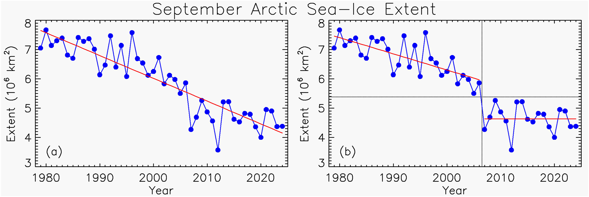

```{r setup, include=FALSE}
knitr::opts_chunk$set(code_folding = FALSE, 
                      echo = FALSE, 
                      cache = FALSE, 
                      cache.extra = 1, 
                      # fig.width = 8,
                      fig.align = "center")
knitr::knit_hooks$set(crop = knitr::hook_pdfcrop)

knitr::opts_hooks$set(label = function(options) {
  if (is.null(options$fig.cap)) {
    options$fig.cap <- paste0("(ref:", options$label, "-cap)")
  }
  
  if (is.null(options$fig.alt)) {
    options$fig.alt <- paste0("(ref:", options$label, "-alt)")
  }
  options
})

library(metR)
library(data.table)
library(ggplot2)
library(rcdo)
library(patchwork)


theme_set(theme_minimal() +
            theme(panel.background = element_rect(fill = "#fafafa", color = NA),
                  legend.position = "bottom", 
                  legend.key.width = grid::unit(1, "null"),
                  legend.key.height = grid::unit(0.5, "line"), 
                  legend.frame = element_rect(colour = "black", linewidth = 0.15), 
                  legend.title.position = "top"))

map <- list(
  scale_x_continuous(name = NULL, expand = c(0, 0)),
  scale_y_continuous(name = NULL, expand = c(0, 0)),
  eliotesis::geom_qmap(),
  coord_sf()
)

scale_level <- scale_y_level(labels = \(x) paste0(x, "hPa"))
```

```{r}

ERAtemp <- function() {
  t2m_file <- here::here("_data/arctic_regime/t2m.grib")
  
  if (file.exists(t2m_file)) {
    return(t2m_file)
  }
  
  request <- list(
    dataset_short_name = "reanalysis-era5-single-levels-monthly-means",
    product_type = "monthly_averaged_reanalysis",
    variable = "2m_temperature",
    year = c("1979", "1980", "1981", "1982", "1983", "1984", "1985", "1986", "1987", "1988", "1989", "1990", "1991", "1992", "1993", "1994", "1995", "1996", "1997", "1998", "1999", "2000", "2001", "2002", 
             "2003", "2004", "2005", "2006", "2007", "2008", "2009", "2010", "2011", "2012", "2013", "2014", "2015", "2016", "2017", "2018", "2019", "2020", "2021", "2022", "2023", "2024"),
    month = c("01", "02", "03", "04", "05", "06", "07", "08", "09", "10", "11", "12"),
    time = "00:00",
    data_format = "grib",
    download_format = "unarchived",
    area = c(90, 0, 20, 360),
    grid = c(1, 1),
    target = basename(t2m_file)
  )
  
  ecmwfr::wf_request(request, path = dirname(t2m_file))
  
  return(t2m_file)
}

```

```{r}
CDR <- function() {
  file <- here::here("_data/arctic_regime/cdr_full_arctic.nc")
  dir.create(dirname(file), showWarnings = FALSE, recursive = TRUE)
  years <- 1981:2024
  
  if (file.exists(file)) {
    return(file)
  }
  
  urls <- paste0(
    "https://polarwatch.noaa.gov/erddap/griddap/nsidcG02202v4nh1day.nc?cdr_seaice_conc[(",
    years,
    "-01-01T00:00:00Z):1:(",
    years,
    "-12-31T00:00:00Z)][(4843738.00):1:(-4858168.92)][(-3850000.0):1:(3750000.0)]"
  )
  
  files <- replicate(length(urls), tempfile())
  res <- curl::multi_download(urls, files, resume = TRUE)
  
  grid <- cdo_griddes(files[1]) |>
    cdo_execute()
  grid[4] <-  "gridtype  = projection"
  grid_file <- tempfile()
  
  grid <- c(grid,
            c("grid_mapping = crs", 
              "grid_mapping_name = polar_stereographic", 
              "proj_params = \"+proj=stere +lat_0=90 +lat_ts=70 +lon_0=-45 +k=1 +x_0=0 +y_0=0 +a=6378273 +b=6356889.449 +units=m +no_defs\"")
  )
  
  writeLines(grid, grid_file)
  
  
  files |>
    rcdo::cdo_mergetime() |>
    rcdo::cdo_chname("cdr_seaice_conc", "aice") |>
    rcdo::cdo_setgrid(grid_file) |> 
    rcdo::cdo_execute(output = file, options = c("-L", "-O"))
  
  remove(files)
  return(file)
}
```

This week I read this new paper "Regime Shift in Arctic Ocean Sea-Ice Extent" [@stern2025].
It argues that Arctic sea ice has entered a "new regime" around 2007, going from a linear decrease to a stable (but lower state) extent.

The core of the argument is Figure \@ref(fig:fig1), which compares a linear fit through the whole period with a linear fit until 2006 and then a constant line after.

(ref:fig1-cap) Figure 1 from @stern2025. "(a) September Arctic sea-ice extent ($10^6 km^2$) from the NSIDC Sea Ice Index. The linear least-squares fit is shown in red with slope $−0.78 × 106 km^2$ per decade. (b) The same data as in panel (a). The vertical dotted line between 2006 and 2007 marks the regime shift or breakpoint. 

```{r fig1, out.extra="class=external"}

```

I was following the discussions about Arctic sea ice around 2007--2012, with people arguing whether sea ice loss was accelerating or not, but eventually I stopped paying attention, so it's interesting to see those discussions continuing even today.
They are particularly relevant in comparison with what is happening in the Antarctic sea ice, which seems to have switched from a slow but steady increase to a dramatic drop, which has also been called a "new regime".

So I wanted to look a bit more into it.

```{r}
arctic_d <- "https://noaadata.apps.nsidc.org/NOAA/G02135/north/daily/data/N_seaice_extent_daily_v3.0.csv" |> 
  fread() |> 
  _[-1, ] |> 
  _[, time := lubridate::make_datetime(as.numeric(Year), 
                                       as.numeric(Month),
                                       as.numeric(Day))] |> 
  _[, .(time, aice = as.numeric(Extent))] |> 
  _[aice < 0, aice := NA] |> 
  _[year(time) < 2025]

arctic <- arctic_d[, .(aice = mean(aice)), by = .(time = lubridate::floor_date(time, unit = "month"))]
```

So, let's start by reproducing the plot.
I downloaded daily Arctic sea ice extent from NOAA and computed September mean extent.
Figure \@ref(fig:arctic-sep) shows the result plus linear fits for the period before and after 2007.

(ref:arctic-sep-cap) September Arctic sea ice extent with a linear discontinuous fit with breakpoint at 2007.

```{r arctic-sep}
arctic |> 
  copy() |> 
  _[month(time) == 9] |> 
  # _[, aice := aice - mean(aice), by = month(time)] |>
  _[, year := year(time)] |>
  ggplot(aes(time, aice)) +
  geom_line() +
  geom_smooth(method = "lm", aes(group = year <= 2006)) +
  scale_y_continuous("Septemebr sea ice extent") +
  scale_x_datetime(NULL, date_breaks = "5 year", date_labels = "%Y") 
```

Indeed, the linear trends are very different.
Is the difference statistically significant?
Kind of.

```{r}
breakpoint <- arctic |> 
  copy() |> 
  _[month(time) == 9] |> 
  # _[, aice := aice - mean(aice), by = month(time)] |>
  _[, year := year(time)] |> 
  _[, before_2007 := year(time) <= 2006] |> 
  lm(aice ~ year*before_2007, data = _)

summ <- breakpoint |> 
  summary()

summ$coefficients
```

The fitting a model with varying slope and intercept for each period shows that the difference in the slope between periods is about `r scales::number(summ$coefficients[4, 1], accuracy = 0.01)` million squared meters per year, with a p-value of `r scales::pvalue(summ$coefficients[4, 4])` which is not hugely significant.

So it seems that at face value the evidence for a change in "regime" based on the slope is not extremely strong.

If we look at all the data the picture grows even more complex.
Figure \@ref(fig:extent-monthly) shows monthly extent anomalies computed using the whole period climatology (this will be important).

(ref:extent-monthly-cap) Monthly Arctic sea ice extent anomalies with a linear discontinuous fit with breakpoint in 2007.

```{r extent-monthly}
arctic |> 
  copy() |> 
  _[, aice := aice - mean(aice), by = .(month(time))] |> 
  ggplot(aes(time, aice)) +
  geom_line() +
  geom_smooth(method = "lm", aes(group = year(time) <= 2006)) +
  scale_y_continuous("Sea ice extent anomaly") +
  scale_x_datetime(NULL, date_breaks = "5 year", date_labels = "%Y") 
```

Now it's harder to say that Arctic sea ice is not decreasing.
The straight line fit starting in 2007 is still very much negative and not too hugely dissimilar from the previous period.
The record monthly minimum was reached just 4 years ago in October 2020.
Statistical significance is a bit trickier to gauge here because monthly values autocorrelated, so the linear fit massively can overestimate residual degrees of freedom (just look at how narrow those confidence bands are!).

A quick fix is to take yearly means.
The linear fit of the yearly mean extent with varying slope and intercept before and after 2006 shows that the change in slope is pretty much not statistically significant.

```{r}
breakpoint <- arctic |> 
  copy() |> 
  _[, .(aice = mean(aice)), by = .(year(time))] |> 
  _[, before_2007 := year <= 2006] |>
  lm(aice ~ year*before_2007, data = _)

summ <- breakpoint |> 
  summary()

summ$coefficients
```

So the evidence for this "regime shift" is looking even weaker.

## Something did change in the Arctic

Now, there is some evidence for something fundamentally changing in the Arctic around 2007.
The monthly time series after 2007 in Figure \@ref(fig:extent-monthly) does look weird; the variability is through the roof.
The reason is that the *seasonal cycle* changed significantly in 2007.

(ref:anomalies-periods-cap) Monthly Arctic sea ice extent anomalies with respect to two different climatologies. The orange line was computed using on the 2014--2024 climatology and the green line was computed using the 1990--2000 climatology. 

```{r anomalies-periods}
arctic |> 
  copy() |> 
  _[, Early := aice - mean(aice[year(time) %between% c(1990, 2000)], na.rm = TRUE), by = yday(time)] |>
  _[, Late := aice - mean(aice[year(time) >= 2014], na.rm = TRUE), by = yday(time)] |>
  _[, .(time, Early, Late)] |> 
  melt(id.vars = "time") |> 
  ggplot(aes(time, value)) +
  geom_line(aes(color = variable)) +
  scale_y_continuous("Sea ice extent anomaly") +
  scale_x_datetime(NULL, date_breaks = "5 year", date_labels = "%Y") +
  scale_colour_brewer("Climatology", palette = "Set2")    
```

Figure \@ref(fig:anomalies-periods) shows monthly sea ice extent anomalies computed either using the 1990--2000 climatology or the 2014--2024 climatology.
The difference is striking!
Anomalies computed with the early climatology look fine until 2007 when they start to swing wildly.
On the other hand, anomalies computed with the latter climatology look fine after 2007 but they swing before.
Figure \@ref(fig:climatologies) shows those climatologies using daily values.
The amplitude of the seasonal cycle is much greater in the latter decade and arguably even the shape is slightly different.

(ref:climatologies-cap) Daily mean Arctic sea ice extent deviation from annual mean computed for the two same periods from Figure \@ref(fig:anomalies-periods).

```{r climatologies}
arctic_d |> 
  _[, .(aice = mean(aice, na.rm = TRUE)), by = .(time = update(time, year = 2000), 
                                                 period = fcase(year(time) %between% c(1990, 2000), "Early",
                                                                year(time) >= 2014, "Late",
                                                                default = NA))] |> 
  na.omit() |> 
  _[, aice := aice - mean(aice), by = period] |> 
  ggplot(aes(as.Date(time), aice)) + 
  geom_line(aes(color = period)) +
  scale_y_continuous("Sea ice extent (anomaly from the annual mean)") +
  scale_x_date(NULL, date_breaks = "month", date_labels = "%b") +
  scale_colour_brewer("Period", palette = "Set2")  
```

This is not new.
Stefan Rahmstorf noticed this a while ago in [this 2017 post](https://tamino.wordpress.com/2017/11/02/cycle-change-arctic-sea-ice-edition/), although I can't seem to find any journal article describing the change.
He also just published [an article analysing this "slowdown"](https://tamino.wordpress.com/2025/05/02/arctic-sea-ice-5/), reaching basically the same conclusions as me.

## Why so linear?

Even though the evidence for a change in linear trend is not huge, I still believe the linear model is not correct.
Mathematically, it can't be, since a linear model would predict negative sea ice extent if extrapolated into the future and an Earth covered in ice if extrapolated into the past.
Statistically, it assumes an additive error model, which also can't be right since could predict negative sea ice.

Physically, we wouldn't expect ice to melt linearly.
Take this extremely simplified equation for the evolution of sea ice concentration at a particular location:

$$
\frac{dC}{dt} = 
\begin{cases}
C\alpha(T-T_f),& \text{if } T\geq T_f\\
(1 - C)\alpha(T-T_f),              & \text{otherwise}
\end{cases}
(\#eq:model)
$$

This essentially states that sea ice concentration C will change at a rate that is proportional to the difference between the temperature and the freezing temperature ($T_f$) with $\alpha$ being the proportionality constant (I'm using $T_f$ as 0°C which is not the correct freezing temperature for ocean water, but in principle it could be any other "equilibrium temperature" that balances thermodynamic freezing/melting with other processes).
But it will melt a proportion of what ice is there (that's the first condition of the equation) and only freeze the open water regions (that's the second condition of the equation).

```{r}
t2m <- ERAtemp() |> 
  cdo_zonmean() |> 
  cdo_execute(options = "-f nc") |> 
  ReadNetCDF(c(t2m = "var167"))
```

```{r}
grid <- t2m[time == time[1]] |> 
  _[lat %in% c(90, 40)] |> 
  _[, approx(lat, t2m, xout = 90:40)] |> 
  setnames(c("x", "y"), c("lat", "temp_start")) |> 
  _[, temp_start := temp_start - 273.15] |> 
  _[, ice_start := ifelse(temp_start < 0, 1, 0)] 
```

```{r}
dC_simple <- function(t, y, parms) {
  temp <- parms[["temp_fun"]](t)
  lambda <- parms[["lambda"]]
  tf <- 0
  
  dt <- temp - tf
  area <- y * (temp > tf) + (1 - y) * (temp < tf)
  
  list(-area*lambda*dt)
}


temp_linear <- function(start = -10, rate = 0.16) function(t) start + t*rate


run_ice_simple <- function(times, ice_fun, ice_start, temp_fun, lambda = 0.1) {
  deSolve::ode(y = ice_start, times = times,
               fun = dC_simple,
               parms = list(temp_fun = temp_fun,
                            lambda = lambda)) |> 
    as.data.table() |> 
    setnames("1", "aice") |> 
    _[]
}
```

```{r}
sim <- grid[, run_ice_simple(times = 0:1000, 
                             ice_start = ice_start,
                             temp_fun = temp_linear(start = temp_start, rate = 0.05),
                             lambda = 0.0005), 
            by = .(temp_start, lat)]

```

Under this conditions, ice subjected to a linear increase in temperature would evolve as shown in Figure \@ref(fig:ice-melt-60), which is very much not linear.
In this model higher latitudes start to melt at different moments because their starting temperature is lower, so it takes more time for it to get above freezing.

(ref:ice-melt-60-cap) Sea ice concentration at different latitudes simulated using the Equation \@ref(eq:model) a forcing temperature with a constant linear trend. 

```{r ice-melt-60}
sim[lat %in% c(60, 70, 90)] |> 
  ggplot(aes(time, aice)) +
  geom_line(aes(color = factor(lat))) +
  scale_y_continuous("Zonal mean sea ice concentration") +
  scale_x_continuous("Time") +
  scale_colour_brewer("Latitude", palette = "Set2")
```

When combining all latitudes to compute an integrated area, the final curve is looks like Figure \@ref(fig:sim-area).
There's an initial period of relative stability, as most regions are still to cold to experience melt, followed by period of rapid melt when the heat reaches most of the domain.
Finally the rate of decrease starts to peter off as there is just too little ice to melt.

```{r}
glf <- function(t, t0, left, right, rate) {
  left + (right - left)/(1 + exp(-rate*(t - t0)))
}
glf_formula <- aice ~ glf(year, t0, left, right, rate)
```

```{r}

model <- sim |> 
  _[, .(aice = weighted.mean(aice, cos(lat*pi/180))), by = .(time)] |> 
  _[,  nls(aice ~ glf(time, t0, left, right, rate), 
           start = list(t0 = median(time), left = max(aice),  right = min(aice), rate = -0.2))]

```

(ref:sim-area-cap) Mean sea ice concentration from the simplified model. 

```{r sim-area}
sim |> 
  _[, .(aice = weighted.mean(aice, cos(lat*pi/180))), by = .(time)] |> 
  ggplot(aes(time, aice)) +
  geom_line() +
  scale_y_continuous("Mean sea ice concentration") +
  scale_x_continuous("Time")
```

Even though a linear model can be a useful approximation to estimate rates of change, we know that it is not correct.
So one can't argue that there has been a fundamental change in the behaviour of Arctic sea ice based on a simple linear model not working well.

@stern2025 does explore briefly what I would expect to be a better model: a [Generalised Logistic Function](https://en.wikipedia.org/wiki/Generalised_logistic_function).

$$
Y(t)=A+{K-A \over (C + Qe^{-Bt})^{1/\nu }}
$$

It has left and right asymptotes (A and K, respectively), a rate of increase/decrease (B) and other shape parameters that I'm not going to use (I'll set $C$, $Q$ and $\nu$ to 1).
This is an S-shaped function that model the idea that the environment has a certain "carrying capacity" above which a species can't grow.

Figure \@ref(fig:sim-fit) shows the same simple simulation and the generalised logistic fit.
The fit works incredibly well!

(ref:sim-fit-cap) Mean sea ice concentration for the simple model with a Generalised Logistic Function fit. 

```{r sim-fit}
sim |> 
  _[, .(aice = weighted.mean(aice, cos(lat*pi/180))), by = .(time)] |> 
  _[, fit := predict(nls(aice ~ glf(time, t0, left, right, rate), 
           start = list(t0 = median(time), left = max(aice),  right = min(aice), rate = -0.2)))] |> 
  ggplot(aes(time, aice)) +
  geom_line(aes(color = "Simulation")) +
  geom_line(aes(y = fit, color = "Fit")) +
  scale_colour_brewer(NULL, palette = "Dark2") +
  scale_y_continuous("Mean sea ice concentration") +
  scale_x_continuous("Time")
```

So this type of function is more statistically sound and has a robust physically motivation.
It also fits the data very well, as can be seen in Figure \@ref(fig:area-sep-fit).

(ref:area-sep-fit-cap) Annual mean Arctic sea ice extent and a generalised logistic function fit. 

```{r area-sep-fit}
arctic |> 
  copy() |> 
  _[, .(aice = mean(aice)), by = .(year(time))] |> 
  _[, fit := predict(nls(aice ~ glf(year, t0, left, right, rate), 
           start = list(t0 = median(year), left = max(aice),  right = min(aice), rate = -0.2)))] |> 
  ggplot(aes(year, aice)) +
  geom_line() +
  geom_line(aes(y = fit)) +
  scale_y_continuous("Annual mean sea ice extent") +
  scale_x_continuous("Time")

```

The authors fit a special case of the generalised logistic function called [Gompertz function](https://en.wikipedia.org/wiki/Gompertz_function) and show it in their supplementary materials, but they reject this fit in favour of their non-continuous piecewise linear fit based on the RMSE of the residuals, which doesn't seem to me like a particularly strong reason to reject such a good and handsome curve.

```{r}
rmses <- arctic |> 
  copy() |> 
  _[month(time) == 9] |> 
  _[, .(aice = mean(aice)), by = .(year(time))] |> 
  _[, fit := predict(nls(aice ~ glf(year, t0, left, right, rate), 
           start = list(t0 = median(year), left = max(aice),  right = min(aice), rate = -0.2)))] |> 
  _[, period := year < 2006] |> 
  _[, fit2 := predict(lm(aice ~ year*period))] |> 
  _[, .(logistic_rmse = sd(aice - fit),
        linear_rmse = sd(aice - fit2))]
```

Also, I can't really reproduce that result!
For monthly September sea ice extent, the RMSE of the piecewise linear regression and the generalised logistic regression are virtually the same (`r scales::number(rmses$linear_rmse, 0.001)` vs. `r scales::number(rmses$logistic_rmse, 0.001)`).

Under this model, the slowdown of Arctic sea ice retreat shouldn't be surprising.
At least, it doesn't seem to be some extraordinary feature that "call for an explanation in terms of physical processes", as @stern2025 puts it.
It's not a fundamentally different state, just the expected curve of sea ice decline.

```{r}
model <- arctic |> 
  copy() |> 
  _[, .(aice = mean(aice)), by = .(year(time))] |> 
  _[, nls(aice ~ glf(year, t0, left, right, rate), 
           start = list(t0 = median(year), left = max(aice),  right = min(aice), rate = -0.2))]
```

What does seem to require explanation is the fact that the rate of sea ice extent is slowing down far from zero.
The yearly mean logistic model predicts a right asymptote of about `r predict(model, newdata = data.frame(year = 10000))` million squared kilometres.
There is still much ice to be melted away, so why are we slowing down?

One (admittedly hand-wavy) explanation is that our simple model is just too simple and that other processes act to stabilise sea ice far from zero.
For example, the model doesn't account for ice thickness and age.
Older and thicker ice is much harder to melt so it could act as a sort of "buffer".

It also doesn't have a seasonal cycle.
Even if temperatures increase, they will be below freezing during the winter, creating some sea ice that might survive until the summer in some areas if the response time of sea ice to temperature is slow enough.

## It's the temperature, stupid

The authors state in their discussion that

> The fact that September Arctic SIE shows no trend during 2007–2024 may at first seem hard to explain.
> The Earth continues to warm, and the Arctic is warming faster than the global average.

However, Figure \@ref(fig:temperature) shows annual mean zonal mean temperature at different latitudes.
Equatorward of 60° or so, the temperature increase has been fairly linear, but in the higher latitudes it also follows an S-shape function that hasn't gone below freezing in most of the polar regions.

(ref:temperature-cap) Zonal mean 2-metre temperature at different latitudes plus a generalised logistic fit for latitudes higher than 60° and a linear fit for latitudes lower than 60°. 

```{r temperature}

nls_safe <- purrr::possibly(\(..) predict(nls(...)), otherwise = NULL)


t2m |> 
  _[lat %in% c(50, 55, 60, 65, 70, 75, 80, 85, 90)] |> 
  _[, .(t2m = mean(t2m)), by = .(year(time), lat)] |>
  _[lat > 60, line := predict(nls(t2m ~ glf(year, t0, left, right, rate),  control = nls.control(maxiter = 100),
                          start = list(t0 = 2002, left = min(t2m), right = max(t2m), rate = -0.2))), by = lat] |>
  _[lat <= 60, line := predict(lm(t2m ~ year)), by = lat] |>
  ggplot(aes(year, t2m - 273.15)) +
  geom_line() +
  geom_line(aes(y = line - 273.15)) +
  facet_wrap(~ lat, scales = "free", labeller = labeller(lat = \(x) paste0(x, "°"))) +
  scale_y_continuous("Annual mean zonal mean temperature") +
  scale_x_continuous(NULL)
```

```{r}
temp_models <- rbind(
  t2m |> 
    # _[lat %in% c(65, 70, 75, 80, 85, 90)] |>
    _[, .(t2m = mean(t2m)), by = .(year(time), lat)] |>
    _[, year := year - min(year)] |> 
    _[lat > 60, .(model = list(nls(t2m ~ glf(year, t0, left, right, rate),  control = nls.control(maxiter = 100),
                                   start = list(t0 = median(year), left = min(t2m), right = max(t2m), rate = -0.2)))), by = lat],
  t2m |> 
    _[, .(t2m = mean(t2m)), by = .(year(time), lat)] |>
    _[, year := year - min(year)] |> 
    _[lat <= 60, .(model = list(lm(t2m ~ year))), by = lat] 
)

temp_realistic <- function(which_lat) {
  model <- temp_models[lat == which_lat]$model[[1]]
  function(t) {
    predict(model, newdata = data.frame(year = t)) - 273.15
  }
}
```

```{r}
sim_realistic <- grid[, run_ice_simple(times = -200:800, 
                                       ice_start = ice_start,
                                       temp_fun = temp_realistic(lat),
                                       lambda = 0.0005), 
                      by = .(temp_start, lat)]
```

I fitted a generalised logistic fit north of 60° and a linear fit south everywhere else and used that as the "forcing temperature" in my simple toy sea ice model.
The result is that, sea ice decline slows down and remains relatively stable well above zero ice.

(ref:sim-complex-cap) Mean sea ice concentrations form Equation \@ref(fig:sim-area) but forced with temperature following the functions fitted in \@ref(fig:temperature). 

```{r sim-complex}
sim_area <- sim_realistic |> 
  # _[lat %between% c(-80, -60), aice := 0] |> 
  _[, .(aice = weighted.mean(aice, cos(lat*pi/180))), by = .(time)]

sim_area |> copy() |> 
  ggplot(aes(time, aice)) +
  geom_line()  +
  scale_y_continuous("Mean sea ice concentration") +
  scale_x_continuous("Time")
```

So has Arctic sea ice decline decelerated in recent years simply because temperature increase has decelerated in the Arctic?

Maybe!

Some evidence for this hypothesis is that even a simple linear regression model of zonal mean September sea ice concentration with zonal mean annual mean temperature at each latitude predicts the observed slowdown (Fig. \@ref(fig:temp-ice-regression)).

```{r include=FALSE}
arctic_zonmean <- CDR() |> 
  cdo_remapbil(ERAtemp()) |> 
  cdo_sellonlatbox(0, 360, 55, 90) |> 
  cdo_zonmean() |> 
  cdo_setday(1) |> 
  cdo_execute()
```

(ref:temp-ice-regression-cap) Observed mean September sea ice concentration in green and mean September sea ice concentration predicted from a linear model on zonal mean 2-metre temperature at each latitude. 

```{r temp-ice-regression}
t2m_zonmean <- t2m |> 
  _[, .(t2m = mean(t2m)), by = .(year(time), lat)]

arctic_zonmean |> 
  ReadNetCDF("aice") |> 
  _[month(time) == 9] |>
  # _[, .(aice = mean(aice)), by = .(lat, year(time))] |>
  _[, year := year(time)] |>
  _[, time := NULL] |>
  _[t2m[, .(t2m = mean(t2m)), by = .(lat, year(time))], on = c("lat", "year")] |> 
  na.omit() |>
  _[, aice_pred := predict(lm(aice ~t2m)), by = lat] |> 
  _[] |> 
  _[, .(lat, year, observed = aice, predicted = aice_pred)] |> 
  melt(id.vars = c("lat", "year")) |> 
  _[, .(value = weighted.mean(value, cos(lat*pi/180))), by = .(variable, year)] |> 
  _[, line := predict(nls(value ~ glf(year, t0, left, right, rate), 
                          start = list(t0 = median(year), left = max(value), 
                                       right = min(value), rate = -0.2))), by = .(variable)] |>
  ggplot(aes(year, value)) +
  geom_line(aes(color = variable)) +
  geom_line(aes(color = variable, y = line)) +
  theme(legend.position = "bottom") +
  scale_y_continuous("September mean sea ice concentration") +
  scale_x_continuous(NULL) +
  scale_colour_brewer(NULL, palette = "Dark2", labels = c(observed = "Observed", predicted = "Predicted")) 
```

## Conclusions

The evidence for a slowdown is much weaker than advertised.
The statistics are simply not robust and depends on the specific month and dataset used (I haven't explored it here, but it also breaks down a bit when using area instead of extent).
Also, we need to be extremely careful of making sweeping conclusions based on short and cherry-picked periods.
We don't want a repeat of the whole "hiatus" debacle.

By the way, [this preprint](https://essopenarchive.org/doi/full/10.22541/essoar.174329135.56312606/v1) (which I came across to just as I was finishing this post), shows that periods of lower melt are not uncommon in forced simulations.
This suggests that just normal natural variability superimposed on a long term trend will look like a "slowdown" [@england2025].

To the extent that there has been a slowdown, it doesn't necessarily represent a fundamental shift in Arctic sea ice behaviour.
There are statistical and physical reasons not to expect sea ice to follow a constant rate of decline even in an environment of linear temperature increase.
We know that the linear model is fundamentally misspecified from the start.

Alternative non-linear models naturally have different "regimes" but they don't necessarily "call for explanation in terms of physical processes".

Independent of all these arguments, the observed slowdown could be simply explained by slower temperature increase in the northern polar regions in the recent decade.
This could easily be due to internal variability and not a meaningful change in the trend (again, let's learn from the "hiatus") experience.
